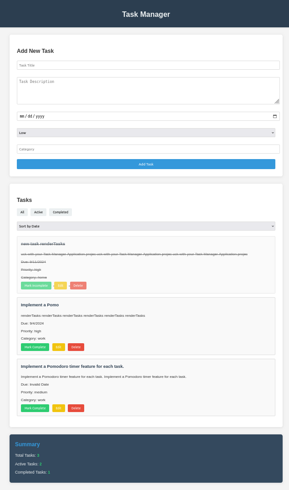

# Task Manager Application



## User Stories

```md
1. As a user, I want to be able to create a new task with a title, description, due date, and priority level.
2. As a user, I want to view all my tasks in a list format.
3. As a user, I want to be able to edit the details of an existing task.
4. As a user, I want to mark tasks as complete.
5. As a user, I want to delete tasks I no longer need.
6. As a user, I want to filter tasks based on their completion status (all, active, completed).
7. As a user, I want to sort tasks by due date or priority level.
8. As a user, I want my tasks to be saved so that they persist even when I close the browser.
9. As a user, I want to categorize my tasks and filter them by category.
10. As a user, I want to see a summary of my tasks (total, active, completed) at a glance.
```

## Technical Requirements

```md
1. Use vanilla JavaScript without any frameworks.
2. Implement a responsive design that works well on both desktop and mobile devices.
3. Use local storage to persist task data.
4. Implement proper form validation for task creation and editing.
5. Use ES6+ features such as arrow functions, destructuring, and template literals.
6. Implement error handling to manage potential issues (e.g., local storage unavailable).
7. Ensure the application is accessible, following WCAG 2.1 guidelines.
8. Optimize performance by minimizing DOM manipulation and using event delegation where appropriate.
```

## Bonus Features

```md
1. Implement drag-and-drop functionality to reorder tasks.
```

## Project Structure

```md
task-manager/
│
├── index.html
├── css/
│   └── styles.css
├── js/
│   ├── app.js
│   ├── taskManager.js
│   └── utils.js
└── README.md
```

## Getting Started

```md
1. Set up the basic HTML structure in `index.html`.
2. Create the CSS file and implement a responsive layout.
3. Set up the JavaScript files and implement the core functionality.
4. Test thoroughly and refine the user interface and experience.
5. Implement additional features and optimizations.
```

Good luck with your Task Manager Application project!
